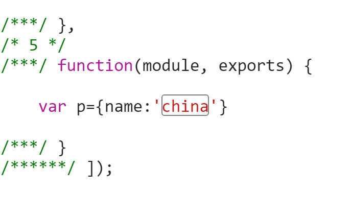

### 1
打包js时 如果js是像下面这样：
test.js

```
var p={name:'china'}

```


在main.js中载入:

```
window.a=require('./test.js')
```


则现在require到的是一个空的对象。因为：

### 2
webpack 执行编译后放到浏览器里面的执行流程:

```

/******/ (function(modules) { // webpackBootstrap
/******/ 	// The module cache
/******/ 	var installedModules = {};

/******/ 	// The require function
/******/ 	function __webpack_require__(moduleId) {

/******/ 		// Check if module is in cache
/******/ 		if(installedModules[moduleId])
/******/ 			return installedModules[moduleId].exports;

/******/ 		// Create a new module (and put it into the cache)
/******/ 		var module = installedModules[moduleId] = {
/******/ 			exports: {},
/******/ 			id: moduleId,
/******/ 			loaded: false
/******/ 		};

/******/ 		// Execute the module function
/******/ 		modules[moduleId].call(module.exports, module, module.exports, __webpack_require__);

/******/ 		// Flag the module as loaded
/******/ 		module.loaded = true;

/******/ 		// Return the exports of the module
/******/ 		return module.exports;
/******/ 	}


/******/ 	// expose the modules object (__webpack_modules__)
/******/ 	__webpack_require__.m = modules;

/******/ 	// expose the module cache
/******/ 	__webpack_require__.c = installedModules;

/******/ 	// __webpack_public_path__
/******/ 	__webpack_require__.p = "";

/******/ 	// Load entry module and return exports
/******/ 	return __webpack_require__(0);
/******/ })
/************************************************************************/
/******/ ([
/* 0 */
/***/ function(module, exports, __webpack_require__) {
	//获取到的对象{
	//  id:1,loaded:true,exports:{},其中 a指向exports 所以默认exports为{}对象
	//}
	module.exports=43
	console.log(exports)
	window.a=__webpack_require__(1);
	window.b=__webpack_require__(2);
	var p={name:'d'}
	console.log('d');

/***/ },
/* 1 */
/***/ function(module, exports) {

	var p={name:'a'}
	console.log('a');

/***/ },
/* 2 */
/***/ function(module, exports) {

	var p={name:'b'}
	console.log('b');

/***/ }
/******/ ]);

/*执行机理

installedModules 执行过程中一直都是在闭包内部的顶级作用域里面，不会被释放。
在背部写入到module.exports后，然后 返回该模块，其他模块可以读取

(function(module){
	installedModules={}；

})([
  function(module,exports){
	

  },
  function(module,exports){
  

  },
])


*/
```

可以看见 在一个模块里面定义的 使用module.exports导出时 ，恰好可以被另一个require的模块获取到参数。
假如是使用define的话
比如:

```
define([],function(){
	return {name:9}
});
```


编译后的结果 该module将被打包为以下形式:

```
function(module, exports, __webpack_require__) {

	var __WEBPACK_AMD_DEFINE_ARRAY__, __WEBPACK_AMD_DEFINE_RESULT__;
	!(__WEBPACK_AMD_DEFINE_ARRAY__ = [],
//执行该函数 并且返回对象，然后使用module.exports导出该对象，使得require该模块的可以得到该对象。
	 __WEBPACK_AMD_DEFINE_RESULT__ = function(){
		return {name:9}
	}.apply(exports, __WEBPACK_AMD_DEFINE_ARRAY__),
//假如有定义的话
	 __WEBPACK_AMD_DEFINE_RESULT__ !== undefined && (module.exports = __WEBPACK_AMD_DEFINE_RESULT__)
	 )

/***/ }
```

可以知道，模块的id是按照载入顺序的 ，比如main是第一个，
mian里面
```
 requrie('a.js')(id=1);
 require('b.js')(id=2);
```
重新require一个模块时，是去查找installmodule下面对象id模块的exports。然后导出，股获取到的是同一个对象。所以不会重新创建。使得在各个模块里面都可以更改同一个模块里面的东西，
从上面分析可以得知 想要在模块内部导出一个模块的话，
假如没有使用define定义的话，使用module.exports来导出
比如:

```

window.a=require("./a.js");
var p={name:'b'}
console.log('b');


setTimeout(function(){
	require("./a.js").name="78";
},3000)
module.exports={
name:90
}
```
使用define来定义的话，要在define的函数里面，return才行。
这样才可以得到结果，然后webpack使用module.exports来导出。

```
define([],function(){

	var name=43;

	return 
	 {
		set:function(value){
		name=value;
	},
	get:function(){
		return name;
	}}
})
```
假如这样打包的话，则返回的是特权方法，name属性在一个模块里面被更改的话，由于其他模块的特权方法所在的闭包都是一致的，其他模块获取到的也是被更改了的。
并且普通的模块 比如：

```

var p={name:'d'}
console.log('d');


setTimeout(function(){
	console.log( require("./a.js").get() );
},4000)
```
虽然 定义了p，但是执行时是在function(){}里面执行的，所以并不会被挂载到window下面。

