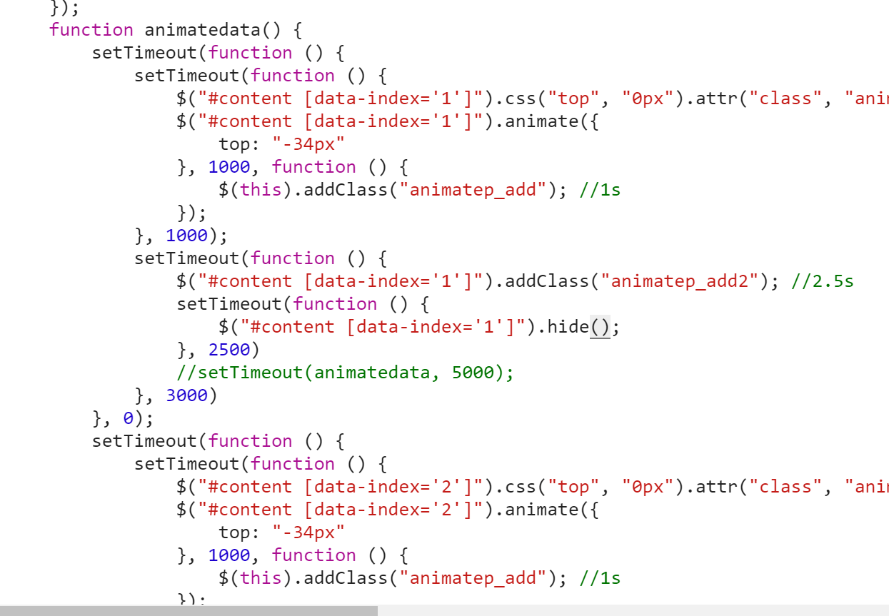

### lazyman 解析
lazyman 可以用于解决 顺序执行一系列方法的问题setTimeout
执行下列一系列方法:

```
LazyMan(“Hank”).sleep(10).eat(“dinner”);
输出:
Hi! This is Hank!
//等待10秒..
Wake up after 10
Eat dinner~
```
实现思路:
- 将待执行的函数，封装为一条一条命令，然后push进自己的一个数组里面，每次调用都从数组前面shift一条命令，然后执行，是命令模式的一种运用方式。将一个一个函数封装为了一个有生命的命令，
可以随时被调用
是为了避免以下问题：



使用封装好的lazyman之后的代码结构。
``` 
 var la=LazyMan('画线');
	    la.delay_excute(function(){
	    	var c=this;
	    	top.draw_line(function(){
	    		console.log('top excute end')
	    		c.next();
	    	});

	    }).delay_excute(function(){
	    	var c=this;
	    	bottom.draw_line(function(){
	    		console.log('bottom excute end')
	    		c.next();
	    	});

	    })
``` 
在执行第一个之后函数完成之后，才去执行第二个。
再回调函数里面自己调用next方法，此时的上下文在lazyman内部会被自动绑定到lazyman实例。
具体实现可以看**lazyman.js** 